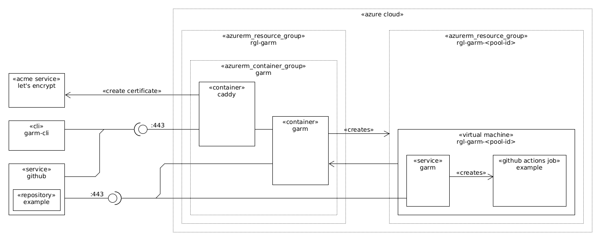

# About

This is a [GitHub Actions Runners Manager (garm)](https://github.com/cloudbase/garm) playground running in Azure.

This shows how to create a [Azure Container Instances Container Group](https://docs.microsoft.com/en-us/azure/container-instances/container-instances-container-groups) with [Caddy (for Let's Encrypt TLS Certificate)](https://hub.docker.com/_/caddy) reverse proxy to the internal garm container.

This is wrapped in a vagrant environment to make it easier to play with this stack without changing your local machine.

After you follow the usage steps, the following components will be running:



## Usage

If you are using Hyper-V, [configure Hyper-V in your local machine](https://github.com/rgl/windows-vagrant#hyper-v-usage).

If you are using libvirt, you should already known what to do.

At GitHub, create a new repository, in this example, its called `terraform-azure-garm-example-repository`, then clone, add, and push the following content:

```bash
git clone git@github.com:rgl/terraform-azure-garm-example-repository.git
pushd terraform-azure-garm-example-repository
install -d .github/workflows
cat >.github/workflows/build.yml <<'EOF'
name: build
on:
  - push
jobs:
  build:
    name: Build
    runs-on: [self-hosted, azure, amd64, ubuntu-22.04]
    steps:
      - uses: actions/checkout@v4
      - name: linux
        run: uname -a
      - name: os
        run: cat /etc/os-release
      - name: current user
        run: id
      - name: sudo user
        run: sudo id
      - name: network interfaces
        run: ip addr
      - name: df
        run: df -h
      - name: installed packages
        run: dpkg -l
      - name: running applications
        run: ps auxww
      - name: working directory
        run: pwd
      - name: working directory files
        run: find -type f
EOF
cat >README.md <<'EOF'
# About

[](https://github.com/rgl/terraform-azure-garm-example-repository/actions?query=workflow%3Abuild)
EOF
git add .
git commit -m init
git push
popd
```

Create the vagrant environment:

```bash
vagrant up --no-destroy-on-error
```

Enter the created vagrant environment:

```bash
vagrant ssh
```

Login into azure:

```bash
az login

# list the subscriptions.
az account list --all
az account show

# set the subscription.
export ARM_SUBSCRIPTION_ID="<YOUR-SUBSCRIPTION-ID>"
az account set --subscription "$ARM_SUBSCRIPTION_ID"
```

Provision the azure infrastructure:

```bash
cd /vagrant
export CHECKPOINT_DISABLE=1
export TF_LOG=TRACE
export TF_LOG_PATH=terraform.log
terraform init
terraform plan -out=tfplan
time terraform apply tfplan
```

In a different shell, show the garm logs:

```bash
# NB to show all the containers logs omit --container garm.
az container logs \
  --resource-group rgl-garm \
  --name garm \
  --container garm \
  --follow
```

Initialize garm:

```bash
# NB this creates the ~/.local/share/garm-cli/config.toml file.
# see https://github.com/cloudbase/garm/blob/main/doc/quickstart.md#initializing-garm
wget -q https://github.com/cloudbase/garm/releases/download/v0.1.5/garm-cli-linux-amd64.tgz
tar xvf garm-cli-linux-amd64.tgz
rm garm-cli-linux-amd64.tgz
chmod +x garm-cli
./garm-cli profile delete garm # NB only required when garm was initialized in a previous test.
garm_admin_password="$(tr -dc 'A-Za-z0-9@#$%^&*()-_=+[]{}|;:,.<>?' < /dev/urandom | head -c 24)"
./garm-cli init \
  --name garm \
  --url "$(terraform output -raw url)" \
  --username admin \
  --email admin@example.com \
  --password "$garm_admin_password"
```

Add a github access token:

```bash
# NB you need to go into your github account and create a new token at
#    https://github.com/settings/tokens. create a classic token with
#    the permissions described at:
#     https://github.com/cloudbase/garm/blob/v0.1.5/doc/github_credentials.md#adding-github-credentials
github_token="ghp_replace-with-the-rest-of-your-github-token"
./garm-cli github credentials add \
  --endpoint github.com \
  --name rgl \
  --description "GitHub PAT for the rgl user" \
  --auth-type pat \
  --pat-oauth-token "$github_token"
```

Add a github repository:

```bash
repo_name='terraform-azure-garm-example-repository'
./garm-cli repo add \
  --credentials rgl \
  --owner rgl \
  --name "$repo_name" \
  --install-webhook \
  --random-webhook-secret
# TODO simplify the repo_id extraction depending on the outcome of https://github.com/cloudbase/garm/issues/292.
repo_id="$(./garm-cli repo list | REPO_NAME="$repo_name" perl -F'\s*\|\s*' -lane 'print $F[1] if $F[3] eq $ENV{REPO_NAME}')"
```

Create a (runner) pool associated with the added github repository:

```bash
# NB for each github action job run, garm will create a vm (and related azure
#    resources) in a new (and ephemeral) azure resource group with the prefix
#    set with --runner-prefix, e.g., --runner-prefix rgl-garm, will create a
#    resource group named rgl-garm-r2BxRNWHNSV4.
# NB see prices at https://cloudprice.net/?region=francecentral&currency=EUR&sortField=linuxPrice&sortOrder=true&_memoryInMB_min=4&_memoryInMB_max=16&filter=Standard_F.%2B_v2&timeoption=month&columns=name%2CnumberOfCores%2CmemoryInMB%2CresourceDiskSizeInMB%2ClinuxPrice%2CwindowsPrice%2C__alternativevms%2C__savingsOptions%2CbestPriceRegion
# NB VM flavor Standard_F2s_v2 is 2 vCPU,  4 GB RAM. 16 GB Temp Disk. €0.0908/hour.  €66.25/month.
# NB VM flavor Standard_F4s_v2 is 4 vCPU,  8 GB RAM. 32 GB Temp Disk. €0.1815/hour. €132.49/month.
# NB VM flavor Standard_F8s_v2 is 8 vCPU, 16 GB RAM. 64 GB Temp Disk. €0.3630/hour. €264.98/month.
# NB you can list the available images using az cli as:
#     az vm image list --location northeurope --publisher Canonical --offer 0001-com-ubuntu-server-jammy --sku 22_04-lts-gen2 --output table
# NB instead of the latest image version we can use a specific version, e.g.,
#     Canonical:0001-com-ubuntu-server-jammy:22_04-lts-gen2:22.04.202206040.
./garm-cli pool create \
  --enabled true \
  --min-idle-runners 0 \
  --max-runners 2 \
  --tags self-hosted,azure,amd64,ubuntu-22.04 \
  --repo "$repo_id" \
  --runner-prefix rgl-garm \
  --provider-name azure \
  --os-arch amd64 \
  --os-type linux \
  --flavor Standard_F2s_v2 \
  --image Canonical:0001-com-ubuntu-server-jammy:22_04-lts-gen2:latest \
  --extra-specs '{
    "storage_account_type": "StandardSSD_LRS",
    "disk_size_gb": 127
  }'
pool_id="$(./garm-cli pool list "--repo=$repo_id" | perl -F'\s*\|\s*' -lane 'print $F[1] if $F[1] =~ /^[a-f0-9\-]{36}$/')"
./garm-cli pool update \
  --min-idle-runners 1 \
  --max-runners 3 \
  "$pool_id"
```

Destroy the solution, starting by destroying the runners, then the pools, then
the infrastructure:

```bash
./garm-cli pool update --min-idle-runners 0 "$pool_id"
# NB before continuing, go into azure and ensure there are no rgl-garm- prefixed
#    resource groups, those should have (or are still) been deleted by garm. be
#    patient, as it can take several minutes to finish.
./garm-cli runner list --all
./garm-cli pool delete "$pool_id"
./garm-cli repo list
./garm-cli repo delete "$repo_id"
terraform destroy
./garm-cli profile delete garm
```

## Caveats

* [There is no way to known the end-user client IP address](https://feedback.azure.com/d365community/idea/c81db3f3-0c25-ec11-b6e6-000d3a4f0858).
  * **NB** The ACI container is behind a load balancer that does not preserve the client IP address.

## Reference

* [azurerm_container_group](https://registry.terraform.io/providers/hashicorp/azurerm/latest/docs/resources/container_group)
* [Container groups in Azure Container Instances](https://docs.microsoft.com/en-us/azure/container-instances/container-instances-container-groups)
* [YAML reference: Azure Container Instances](https://docs.microsoft.com/en-us/azure/container-instances/container-instances-reference-yaml)
* [Caddy](https://github.com/caddyserver/caddy)
* [Caddy Docker Image](https://github.com/caddyserver/caddy-docker)
